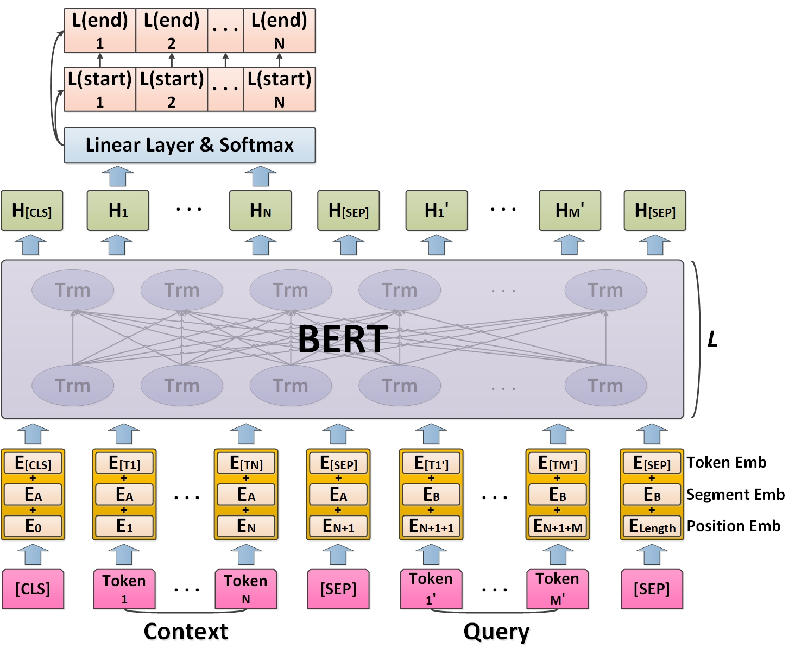

# Biomedical named entity recognition using BERT in the machine reading comprehension framework


## Paper ##
[Biomedical named entity recognition using BERT in the machine reading comprehension framework](https://www.sciencedirect.com/science/article/pii/S1532046421001283)

## Model structure ##


## Tested environments ##
* Ubuntu                    16.04
* python                    3.6.9
* transformers              2.5.1
* torch                     1.6.0
* numpy                     1.19.4
* pandas                    1.2.3
* scipy                     1.4.1

## BERT weights ##
biobert_v1.1_v2.5.1
[biobert_v1.1_v2.5.1](https://drive.google.com/drive/folders/1G1PsTtCSNIL4XgEgp7KwJCChY1HKh7VD)

## Run models ##
002-BERT_MRC_BC4CHEM.ipynb

## Cite ##

```
@article{SUN2021103799,
title = {Biomedical named entity recognition using BERT in the machine reading comprehension framework},
journal = {Journal of Biomedical Informatics},
volume = {118},
pages = {103799},
year = {2021},
issn = {1532-0464},
doi = {https://doi.org/10.1016/j.jbi.2021.103799},
url = {https://www.sciencedirect.com/science/article/pii/S1532046421001283},
author = {Cong Sun and Zhihao Yang and Lei Wang and Yin Zhang and Hongfei Lin and Jian Wang},
}
```

